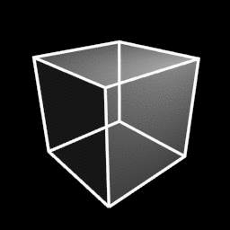

## Slit Scan
This sketch creates animations using a technique by which frames are slightly transformed as they are rendered, creating a time-delay or slit-scan type of effect

input:

output:

change granularity:

polar coords:

